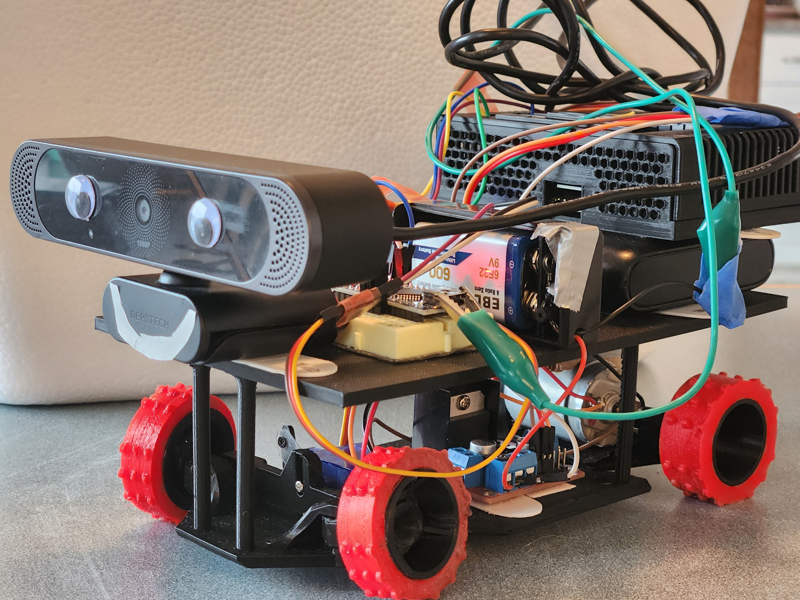
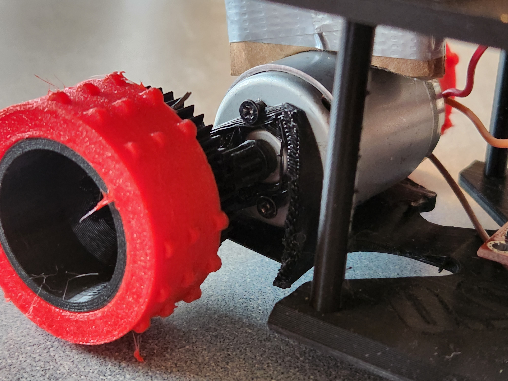
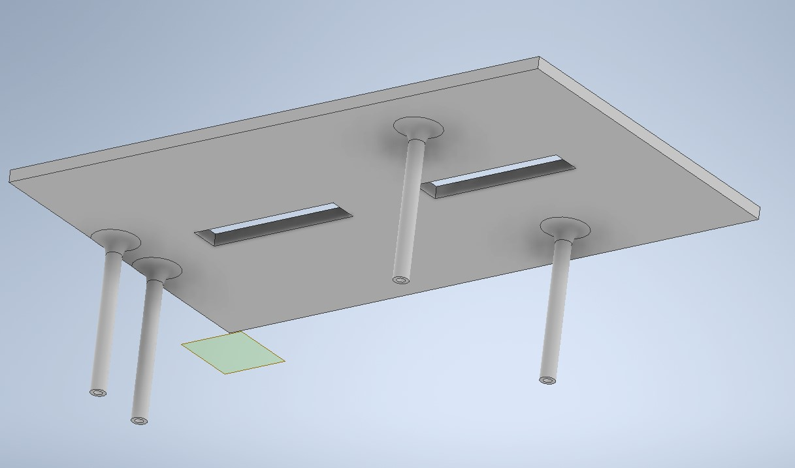
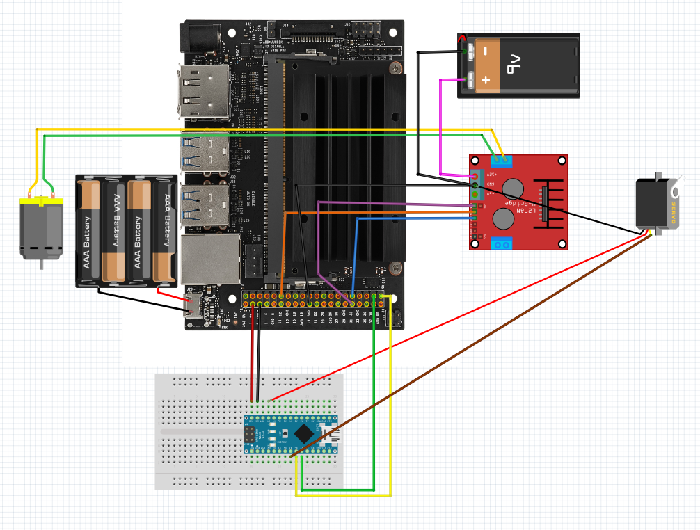
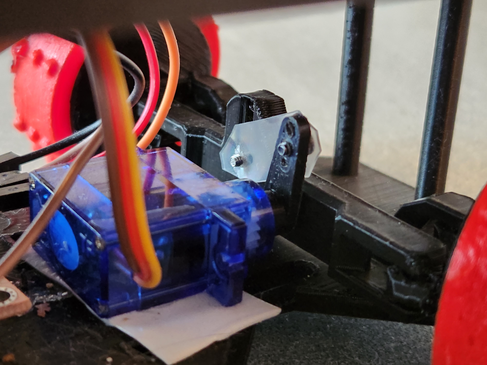

# Independent Study: AI Edge Computing on an RC Car avoids shoes!

## What is this?

An independent study project at Seattle Pacific University. The purpose was to learn more about machine learning and put a fun twist on it. This project consists of a small car (RC car size) that has a camera and computer on board. In normal operation, the car sits still until it detects foot wear through machine learning, at which time it moves away from it.

**Project Requirements:**

- Use machine learning to detect a type of object
- Perform an action based on object detection and location of object

## Meet Harold



Harold is made up of the following parts:

- A USB Webcam
- USB to wifi adapter
- Nvidia Jetson Nano developers kit
- USB Powerbank
- Micro USB Cable
- 9V battery and connector
- Arduino Nano and mini breadboard
- 3D printed car chassis; **3rd party design used **, see [here](https://cults3d.com/en/3d-model/gadget/gamma-2-demo) for original design and author
- 3D printed shelf for electronics
- 3D printed Tires in TPU
- 3D printed case for Jetson Nano board. **3rd party design used**, see [here](https://www.thingiverse.com/thing:3518410) for original design and author
- DC motor
- DC motor controller: L298N
- Mini servo motor
- Thin flexible piece of plastic for servo arm. Product package material works great for this.
- Misc. command strips for mounting parts
- Misc. Dupont jumper wires
- Misc. screws
- Googly Eyes

### Hardware:

#### Car parts:

**Starting point**: The gamma 2.0 is an amazing 3D print-in-place car. It was designed by UNDER_ENGINEERED and is available for free on [cults3d.com.](https://cults3d.com/en/3d-model/gadget/gamma-2-demo) Unfortunately, the small motor used in this design was not powerful enough to move the car and all of the needed components for this project. 

**Modifications**: 

- **Design:** I had a larger more powerful motor at my disposal but it would not fit in the the original design for the gamma 2.0 car. I found the percentage of how much larger the new motor was based on it's radius. I then created a 3D model of the new motor in 3D CAD software, scaled the gamma 2.0 car by the same percentage, and test fitted the parts in 3D CAD software. It worked! ...Mostly.

- **Printed:** After printing the newly scaled design, I noticed four issues.

  - The back support for the motor blocks the new motor from fitting. The motor was too long. Removed back motor support with wire snippers. Motor will be held in place with screws on the front side of the motor. See below:

    

  - The front wheel servo motor support did not align correctly for correct use. Removed with wire snippers. Servo motor will be mounted with a command strip instead.

  - The hole the front side of the motor is supposed to be inserted into is 0.1 - 0.2 mm to small. Used heat gun to soften plastic, then insert motor.

  - Even with the newly scaled and printed car, there is not enough room for all the components. Created a shelf for parts to sit on. See below:

    

#### Circuit:




### Software:

##### Getting Started:

This project is designed run on an Intel Jetson Nano running this [OS image.](https://developer.download.nvidia.com/embedded/L4T/r32_Release_v5.1/r32_Release_v5.1/Jeston_Nano/jetson-nano-jp451-sd-card-image.zip) Follow these steps listed [here](https://developer.nvidia.com/embedded/learn/get-started-jetson-nano-devkit#write), to flash the OS Image. Then follow the steps below to get started:

1. Ensure docker is installed: `sudo docker --help`. See guide [here](https://docs.docker.com/engine/install/ubuntu/) to install docker engine.

2. Enable PWM on pin 33.

   1. Run: `sudo /opt/nvidia/jetson-io/jetson-io.py`
   2. After step 1, a menu should appear. Select "Configure 40-pin expansion header" and press enter.
   3. After step 2, another menu should appear like the one below. Ensure "pwm2" is enabled.

   ```
    |                 [ ] aud_mclk      (7)                              |
    |                 [ ] i2s4          (12,35,38,40)                    |
    |                 [ ] pwm0          (32)                             |
    |                 [*] pwm2          (33)                             |
    |                 [ ] spi1          (19,21,23,24,26)                 |
    |                 [ ] spi2          (13,16,18,22,37)                 |
    |                 [ ] uartb-cts/rts (11,36) 
   ```

   4. Select "Back", then "Exit". Select to reboot to apply changes and press enter.

3. Download this repo and git sub-modules: `git clone --recurse-submodules https://github.com/whitea17/ISTUD_AI_CAR.git`

4. Change directory to root of this repo:`cd ISTUD_AI_CAR`

5. Open `AI_dectection.py` and edit any variables as needed. For example, pin definitions, turn speed, or threshold.

6. Build the docker image: `sudo docker build . -t local/istud_ai_car`

   > **Any** changes to AI_detection.py will require a rebuild of the docker image to take effect.

7. Open `docker-run.sh` and edit environment variables as needed. For example, input device, or the output stream.

8. Run: `./docker-run.sh`, the program should now be running.

   > Add "/bin/bash" to the end of the docker run command inside of `./docker-run.sh` to drop to a shell inside of the docker container. This can be useful for debugging.

##### What if I want to detect something other than shoes?

Follow this guide [here](https://github.com/dusty-nv/jetson-inference/blob/master/docs/pytorch-ssd.md) to train a new model on a different data set. Then include the new model under the models folder in this repo. Additionally include the accompanying labels.txt file. Then update `docker-run.sh` point to the new model and labels file.

> Note: the first run of a new model will take 5 - 10 minutes to start. The jetson-inference library takes time to interpret the onnx model. After the first run, a engine cache file is created. Subsequent runs should be much faster.


## Demos:


## Project Log:

- Browse 3D design websites for suitable RC car design. Found the gamma 2.0 print-in-place car

- Print and test gamma 2.0

  - After printing the car, I wanted to run some quick tests to see if it would work for my needs. I seated the USB power bank that would be used to power the Jetson Nano and the motor onto the car. Then, I proceeded to power the back motor with the power bank. This was to test if the car could move with some weight on it. It couldn't. This was a problem, as I didn't find any other suitable 3D designs online.

  - I had a bigger motor but it wouldn't fit in the current car chassis. What if I make the car bigger? I did just that. I measured the size of both motors, hoping that their different dimensions (length, diameter, radius to the spindle) all scaled uniformly.  For the most part, they did. These were'nt exact measurements because the geometry was difficult to measure with calipers. Will this work? Do I want to waste 2 -3 prints (each 15+ hours), trying this theory? no. Instead, I modeled the bigger motor in 3D CAD software and test fitted it with a scaled version of the gamma 2.0. It works!

  - Fast forward to after the 18 hour print. The motor doesn't fit. It's to long and wont with through mounting hole for the spindle. I made some manual modifications by snipping away parts of un-needed plastic and heating the mounting hole for the motor with a hot air gun. Everything is fitting!

  - With the larger car and motor, I ran the same weight/movement test again but with stacked the Jetson Nano and Web Cam also on top of the car. It moved but was slow. I decided to power the motor with a 9v battery instead of the 5v USB power bank. Now its moving faster. I also 3D designed a shelf to better hold all the components. Additionally, I designed and printed better tires. The provided tire models were too smooth, I redesigned the tires to have studs on them.

  - The mounting and connection of the servo motor with the front wheels was a bit difficult. At first, I tried attaching the servo arm to the front axel with a paper clip as shown in example photos of the gamma 2.0. No luck. Instead, I tried cutting a piece of plastic from a container that held my dinner; popcorn chicken. Weirdly enough it worked. This whole project only works because of a small piece of plasitic from a container that held my dinner.

    

  - At this point, all the hardware needed is mounted and installed on the car. As I was familiar with Arduino code. I wrote a quick test program to communicate with the motor controller and servo motor. The car can now move forwards, backwards, left, and right.

- Interfacing the Jetson Nano with the motor controller and servo motor

  - The Jetson Nano has python library to communicate GPIO pins. Additionally, the motor controller changes the state of the motor based off two GPIO pin states. This was simple enough to make the car move forwards or backwards at full speed. The speed however is controlled by third pin that enables or disables the motor. By sending a PWM signal to this pin, the speed can be controlled. Unfortunately, the Jetson Nano's documentation regarding PWM on GPIO pins is severely lacking. After much research, I discovered that PWM is only available on two pins and must be enabled in an obscure configuration tool as show in step two of getting started.
  - I also had difficulties with getting the servo motor to communicate with the Jetson Nano. I eventually realized that the servo motor is of 5v design while the Jetson nano GPIO pins run at 3v. To remedy this, I added the Arduino nano which operates at 5v to be a translator between the Jetson nano and the Servo motor. 

- AI machine learning for object detection

  - I initially started researching different types of machine learning that could be used for object detection. I found a wonderful article that outline different types. That article can be found [here](https://kili-technology.com/blog/image-recognition-with-machine-learning-how-and-why). A Single Shot Detection aka SSD looked to be efficient and suitable for the project's needs. Knowing that nvidia provides lots of information and helpful guides for the Jetson Nano, it wasn't hard to find a guide for training an SSD model. That guide can be found [here](https://github.com/dusty-nv/jetson-inference/blob/master/docs/pytorch-ssd.md). Lucky enough, the guide also provide a place that had multiple different datasets of images that already have annotations of specific objects in images. At this point, I just needed to follow the guide and experiment. 
  - My first attempt was unsucceful. I trained a model on 10,000 images of foot wear for 30 iterations (epochs). This was the recommended iterations by the guide. It could not detect any foot wear while use. After looking at a few other sources, it became clear the higher number of iterations, the better. My second model took a day and a half to train, with 8,000 images and 100 iterations (epochs). It was able to recognize foot wear at a confidence level of 30%. While 30% may seem low, it had very few false positives. I at this time, I also started training a third model on a spare laptop. This time with 4,000 images and 800 iterations. I noticed by decreasing the total number of images the training iterations took less time.

- Detect and respond to object detection:

  - I reviewed example python program called detectnet.py. It uses a specified model, reads an input image, and prints out info about detections. After some experimenting with this example, I found that I could get the confidence level and center of detected objects. I took this information and  wrote a main program that does the following:
    - In a loop:
      - Grab a new image from the webcam
      - Run AI detection on it
      - If objects found:
        - Loop through found objects find the highest confidence score. Call this most_confident.
        - If the center of most_confident is greater than (the total width of the screen / 2), print "move left"
        - If the center of most_confident is less than (the total width of the screen / 2), print "move right"
      - Else: print "do nothing"
  - After this was tested, and confirmed to work. I integrated motor controls into the main program and associated the print statements, "move left", and "move right" with their corresponding motor movement.
  - Debugged, streamlined, and refined code
    - Through most of my testing, experimenting, and development of this program, it was done inside of the docker container and environment provided by the example program. This required 3 - 5 steps of copying and installing stuff on any fresh start of the docker container. This needed to be fixed. I created a Dockerfile which is a recipe to build a docker image, that takes the example's docker images, uses as a starting point, and runs my code on top of it automatically.